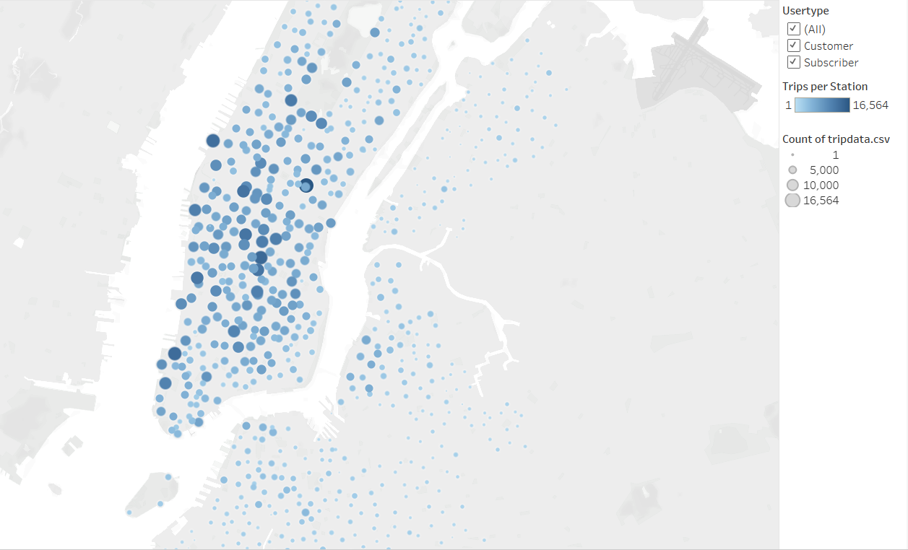
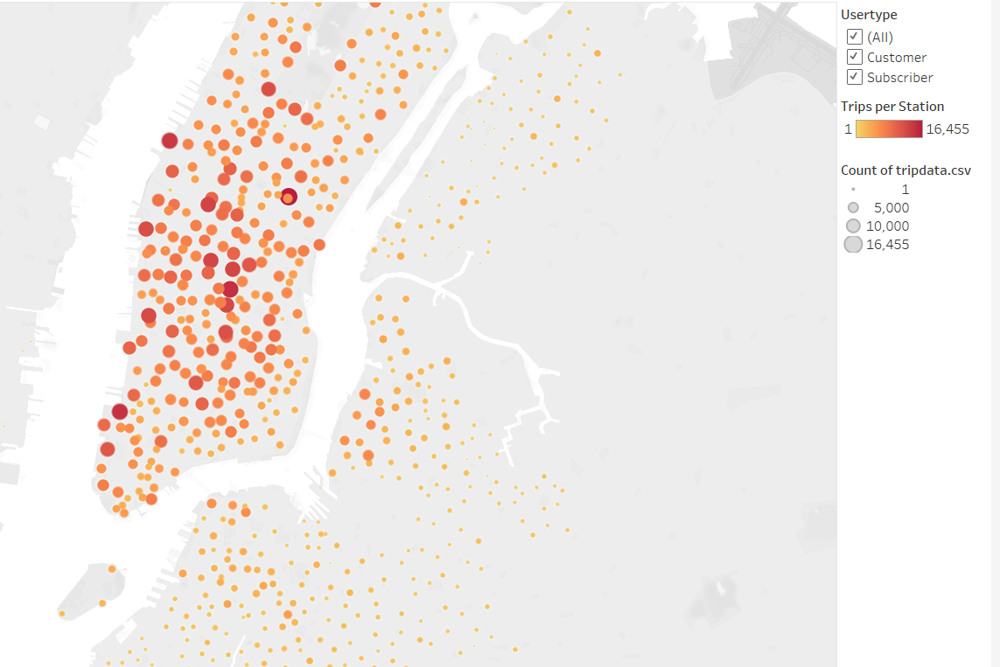
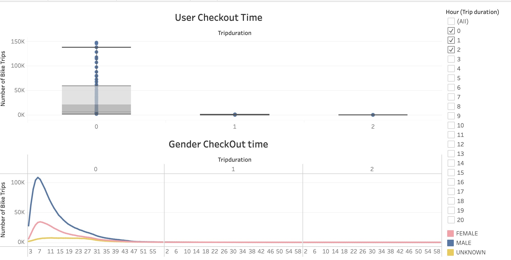
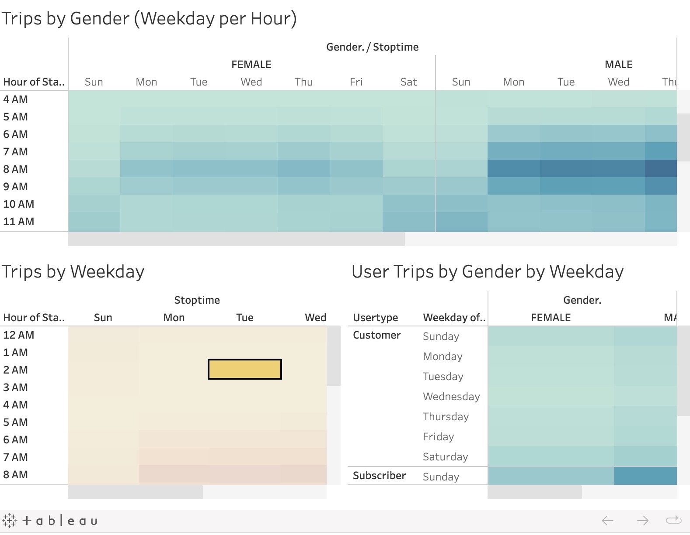

# bikesharing
[link to dashboard](https://public.tableau.com/app/profile/huzaifa.hussain3074/viz/ChallengeH/Dashboard1)

# Bikesharing

## Overview of the analysis

Working with Tableau's data visualization software to present a bike-sharing company's business proposal. 
By learning to accurately portray data we can determine how often the bikes are used and which gender used the bikes most often.

## Results

### 1 Top Start Locations

### 2 Top End Locations

### 3 Customer Profile

### 4 Checkout times

### 5 Trips by weekday

## Summary

Based on the data set we analyze we feel confident to share with the investors the following facts:
- 65.2% of Citi bikes' customers are men 
-8 AM is the most popular time on weekdays
-Men/Women 28+ years should be the target client based on the data
- 3/4 of the trips were less than 19 minutes.

### Next Steps

- Forecast monthly incomes
- How to account for peak riding times, how to ensure everyone tha tneeds bikes will get them
